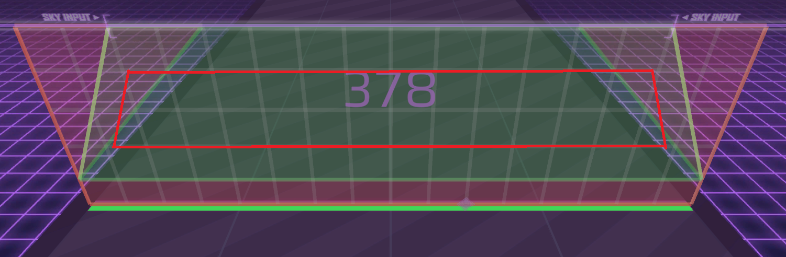

<!-- ---
layout: page
title: 
comments: false
permalink: /arcaea/
--- -->

# Arcaea

Hi, I play Arcaea. In fact, I\'ve been playing for a short time. Of 7 years. I didn\'t realise it\'s been that long, but I have memories of buying Vicious Labyrinth when it released, and that\'s apparently 7 years ago.

Holy shit, I\'m getting old.

Still potential 11 at the time of writing. Insert skill issue here.

In my defense, I\'m a thumb player, and thumb players are worse at speed. Bengalee is an exception to this.

Because my speed is not ideal, I\'ve spent a large part of my time optimising my movements, analysing charts, and figuring out anomalies. Figuring out anomalies is difficult when you\'re doing it on your own without any help from the official wiki. Ask me how I know.

I play with colourblind mode on, not because I\'m colourblind, but because I prefer the colour scheme.

I can\'t read light-side charts at all.

Axium crisis is the easiest 10+. Fight me on that.

___

Table of Contents:

- [Arcaea](#arcaea)
  - [Tips and Tricks](#tips-and-tricks)
  - [Skillsets](#skillsets)
    - [Accuracy](#accuracy)
    - [Stamina](#stamina)
  - [Miscellaneous Tips](#miscellaneous-tips)
    - [Sky input](#sky-input)
    - [Reading Light Side charts](#reading-light-side-charts)
  - [How do I improve at](#how-do-i-improve-at)
    - [Anything in general](#anything-in-general)
    - [General accuracy](#general-accuracy)
    - [Shiny pure accuracy](#shiny-pure-accuracy)
    - [Stamina 2.0](#stamina-20)
    - [Tech](#tech)
    - [Streams](#streams)
    - [Crosshands](#crosshands)
    - [Slow Notespeed Charts](#slow-notespeed-charts)
    - [Speed Change Charts](#speed-change-charts)
    - [Sky notes](#sky-notes)
    - [That one section you can't PM](#that-one-section-you-cant-pm)

___

## Tips and Tricks

Most of the tips and tricks are updated from [this blog](https://shizukunoshinden.carrd.co/#arc) by Marina. I do recommend you read it if you want information about pack purchases. The tips and tricks will be repeated here, including anything I have to add.

___

## Skillsets

As with all rhythm games, the gameplay can be split into different skillsets.

In Arcaea, skillsets are usually split into 2 categories:

### Accuracy

Accuracy is the ability to set \'high score\' plays, usually an EX+ on charts at your current skill level.
Some definitions also claim that PMs are the criteria for the play to be \'high score\'.
Almost no definitions claim that max PMs are the criteria for \'high score\' plays.

Unless you\'re Aploplex.

In the extreme case, the ideal accuracy player could get PM on 9s every time, but get Bs or Cs in 9+s.

___

### Stamina

Unlike other games, Arcaea players consider stamina to be your ability to set average or above scores.

This sounds like a weaker version of accuracy, but stamina is more about your ability to barely pass harder charts.

In the extreme case, the ideal stamina player could AA or low EX every chart, but they can\'t hit EX+ on any chart.

___

It\'s not easy to figure out how good your accuracy or stamina is. It isn\'t necessarily beneficial to find out, either.

You should judge your skill based on your ***average*** ability, **not** your *strongest* ability, **nor** your *weakest* ability!

Potential doesn\'t really say much about whether you\'re an accuracy player, nor a stamina player.
As stated by Marina, you don\'t actually need to play charts >10 until 12.00 ptt, nor PM anything until 12.5 ptt.

Most players tend to be biased towards accuracy, but there\'s nothing wrong with being a stamina player.

___

To improve accuracy, you can try to PM lower-level charts, even PST or PRS charts.
Shiny PURE percentage is an OK gauge of accuracy on charts you have PMed before[^1].
<!---Todo replace the fandom link with my own link once I get it out.-->

To improve stamina, you can try playing hard charts **that you can read**.
If you can\'t read the chart, please don\'t play it. You\'ll build bad muscle memory[^2],[^3].

As stated by Marina, you should focus on the other skillset when you\'re having trouble on one skillset.
Most people improve the quickest when they work on a variety of skillsets at once.

___

## Miscellaneous Tips

A lot of these tips have parts that are directly quoted from Marina.
If they\'re quoted directly, I\'ll place them in quote blocks.
Anything I add or rephrase will either be outside the quote blocks, or in `code blocks`.

### Sky input

The sky input boundary is not a rectangle, but a trapezium.

Green area: Area where sky notes and arcs are generally placed.

This means that you can disregard those sections in most cases, which can technically help reduce mental load.
Chances are, you\'ve noticed this instinctively, though.

Previously, notes placed in the red area would only appear in Beyond charts, but as of late, they\'ve appeared in some future charts (Ahem, Manic Jeer).

___

### Reading Light Side charts

This isn't a problem everyone has. By process of possible blindness, I have it, so I'm including all the tips I've found to solve this problem anyways.

- Use Hikaritsu Reunion to switch Light-side charts to the Conflict-side.
- Increase phone brightness
- Play charts with lots of sky notes, tech and reading patterns (e.g. Halcyon, Live Fast Die Young, Attraqtia, Defection, Lightning Screw, or LAMIA) in Conflict mode to improve your overall reading ability.
- Adjust your note speed. It may or may not help, but once you're comfortable with it, **stay with it**. Adjusting it all the time will fuck with your hand-eye coordination (Or reading muscle memory? Idk), which makes it counterproductive.
- If it's hard to read the timings of sky notes, try reading the shadows under them. It might increase how much you have to read, but it's better than being unable to read anything.
- Switch over to Light-side once you're used to the chart in the Conflict-side.

___

## How do I improve at

### Anything in general

> Play all the charts you can, as long as you can read them. And play frequently if you can! The only `reliable` way to get better at rhythm games is by playing them.

Remember that frequently and constantly do **not** have the same meaning!
Playing the games 10 hours a day every day may not help you improve over long periods of time.
Your muscles have to rest, and rhythm games require rather intense concentration.

Playing over and over again might also cause mind block.
If you retry a pattern you misread over and over again, yet continue to miss them, you might build an association between that pattern and the incorrect movement.
Not good.

Your skills don\'t exist in a vacuum.
If you fail to hit a fast pattern consistently, it may not just be about speed.
It\'s possible that, if you just train reading, you\'ll somehow find a better way to play it, thus lowering the speed requirements.

(Also, you\'ll see why I added `reliable` there in a few sections)

___

### General accuracy

> General accuracy: Play charts well within your comfort zone (including PST or PRS charts) and try to PM them or improve shiny pure accuracy.

You can also try listening to the song.

Without hitsounds.

The hitsounds can massively fuck up your perception of the rhythm.
Tapping a short section of 1/3 notes as 1/4 notes will make it sound like 1/4 while you\'re playing, despite the LOSTs and FARs you\'re probably getting.

Also, I can\'t believe that I have to say this, but play with sound.
People claiming they\'ve not improved by not hearing the music have probably never played SUPERNOVA or Genesis (From the Chunithm collab).

Also, playing with hitsounds on is usually considered better when playing rhythm games. They help you sync your hitsounds with the music, thus figure out if you\'re early or late.

You should not be playing with your offsets often.
Messing with your offsets too often can make you reliant on it.
Maybe for the first week or month of playing, sure. But, if you keep adjusting it, you might have something wrong. Try just turning off hitsounds, and syncing to your taps.

___

### Shiny pure accuracy

> Listen to the songs outside of the game.
> Try to get a feel for the rhythms and take note of what patterns are used in a chart.
> If you are trying to get max PMs or come close to doing so, I would strongly advise starting with songs you already know well.
> (If you play Kalpa, then trying out Lunatic Mode in that game may also help since the timing is apparently the same.)

For hopefully obvious reasons, this is quite similar to improving general accuracy.

Since you can\'t adjust judgement timings in Arcaea, the usual method of playing with tighter judgements doesn\'t work here.

___

### Stamina 2.0

This \'stamina\' here does not refer to the stamina skillset, but your actual, physical stamina.

Learning to conserve stamina is just as important as building it.

> Play charts at the upper limits of your comfort zone to push yourself gradually.
> Try not to make exaggerated taps or arm movements; keep your fingers close to the screen.

Remember to tap softly. The harder you tap, the more energy you waste.

> Consider adopting a multifinger playstyle if endurance is a real issue for you, since this will spread the exertion out across more fingers.

I don\'t think that is the main advantage of a multifinger playstyle, but sure. I don\'t play fingers enough to comment.

___

Finally, some advice for thumb players!

Shock. Haven\'t seen that in a long time.

When playing handheld, you can push your screen up with your other fingers to touch your thumb.
For me, it saves quite a bit of stamina, since the exertion is spread to the other 6 fingers that I use to support my phone.

Common stamina charts include:

- felys final remix (9)
- SUPERNOVA, Einherjar Joker, Genesis (Chunithm) (9+)
- G e n g a o z o, STARGATE EXTREME, Overwhelm, Eden, Back to Basics (10)
- Distorted Fate (10+), and
- SAIKYO STRONGER (11)

At least from my experience as a thumb player. Maybe it\'s different for tablet players. Feel free to correct me.

___

### Tech

There\'s no solid definition for tech charts.

Tech charts are usually just weird to play, or difficult for reasons of "Why can\'t I hit that pattern?" or "Wtf is that pattern?".
Other than that, it\'s difficult to categorise the charts[^4].

Alternate definition. If you see a chart:

- Was charted by Exschwasion,
- Was charted in the past 3 years,
- Was charted by Exschwasion, or
- Was charted by Exschwasion,

It\'s probably a tech chart.

> Tech charts tend to want you to understand them in order to play them well.
> Research them by watching PM (not chart view) videos online before you play, and for songs with complicated rhythms, listen to them repeatedly to ensure you know what to expect from them.

How fun.

Common tech charts include:

- Anything charted in the past few years, in general
- More or less all Beyond charts, since Beyond charts were originally introduced to enable more technical patterns
- Heart, Loveless Dress, OMAKENO Stroke, ENERGY SYNERGY MATRIX, Remind the Souls (Short ver.), Redraw the Colorless World, Purple Verse (9)
- Ai Drew, New York Back Raise, Distortion Human, Callima Karma (9+)
- Chromafill, Ultradiaxon N3, corps-sans-organes, Aleph-0, Redolent Shape, NULL APOPHENIA, G e n g a o z o, Ego Eimi (10)
- Axium Crisis (Not for me, but for every tablet player), Divine Light of Myriad (crosshands), LAMIA, CHAOS (10+)
- Arghena, Fracture Ray (11)

___

### Streams

In Arcaea, streams usually just refer to long sections of single notes with a consistent rhythm.

> Most streams want you to follow the rhythm without overthinking it, and they tend to alternate.

Remember to stay consistent when you alternate.

Also, don\'t think that you can cheese it by playing them as jumps, like in osu!mania. No charts are fast enough to enable that. Cheesing will also screw up your muscle memory, and that\'s bad[citation needed].

To practise streams, you can play charts that have a lot of trills.
Trills will drill the muscle memory of alternating and tapping at a constant rate into your muscle memory.

Such charts include:

- SUPERNOVA (<- Free)
- Genesis (Chunithm)
- G e n g a o z o (<- In world archive; good value for money.)

___

### Crosshands

> Position your hands and arms so you are covering as little of the screen as possible. Unfortunately there are some charts where this is incredibly difficult to do; in those cases you may have to memorize note positions instead.

Insert thumb player superiority here.

In charts like Divine Light of Myriad Crosshands, you can avoid the crosshands by just tapping the hold notes lower.
The hitboxes of floor notes extends below the line, which can make more space for your hand to do whatever trill is needed.

For thumb and handheld players, your grip is paramount, here.

To test your grip, play SUPERNOVA. Your thumb should be able to comfortably **trill** the trills.
It doesn\'t matter whether you can comfortably play it with one hand; trill it.
Adjust your grip until you can trill it.

Once you hit a certain point, there\'ll be even harder trills, crosshands, or trains that may not even be in the common hit area[^5].
Not much you can do here, other than play Manic Jeer, and update your grip as needed.

___

### Slow Notespeed Charts

> You can practice for slow charts by setting your note speed to about 2 or so and playing PRS 7s, which should have roughly the same note density.
> During slow charts or sections, try to focus on the notes immediately in front of you and not on what is coming up in the distance

Also, it\'s not just about tapping too fast, it\'s about tapping fast enough. Also, remember to tap based on rhythm rather than what you\'re reading.
It\'s natural if your timing is off. Faster notespeeds makes it much more obvious when to tap, since the gap between timings are much more visible.

___

### Speed Change Charts

> Speed change charts require you to be able to adapt to what they throw at you beyond just being able to read the slow parts.
> Arcaea does not have indicators `specifically made for speed changes`, so unfortunately you\'re stuck with watching for subtle tells in the chart (notes getting closer together or farther apart`, bar lines appearing before or after they\'re supposed to`) and memorizing when it speeds up or slows down.

Speed change charts are also knows as SV (Speed Variation) charts and soflan in osu!mania and most other VSRGs respectively.

All of the tells are emergent behaviours caused by the speed changes.

Thing is, they may not be indicative
For example, the sudden reversals in [<ins>ALTER EGO</ins>](https://youtu.be/9yML3LPwE3g?si=ae_pRvJepRESGJmK&t=110) and [<ins>Désive</ins>](https://youtu.be/5diyFaPKkDo?si=EwsPVu43BC4Q2bnc&t=158) doesn\'t look strange, until you tap them, when you may accidentally let go.

They also don\'t tell if if it speeds up or slows down.

The bar lines are also quite difficult to see, especially with all the arcs, traces and whatnot.

Regardless, too bad. You just have to get used to it.

___

### Sky notes

For simplicity, let\'s call both arcs and sky notes \'sky notes\', renaming the actual sky note to \'arctaps\'.

Sky notes\' input areas are fuzzy by design. In practise, you could technically just tap in the area enclosed by the red trapezium...

...and be perfectly fine.

This is because the height of the sky notes\' hit boxes extends quite far above and beyond the actual note.
Therefore, when you tap sky notes, you should take note the horizontal axis more than the vertical axis.

This is not saying that you should only tap within the trapezium shown above.
Tapping above the note can give you more space to manoeuver under your hand.

In the case of trains (Or a long jack), you can tap above and below the arctap to play it as a trill.
By process of \'More finger more easier to go more faster\', it makes an impossibly fast jack into an alright jack.

Unless you\'re playing Ouroboros or Rise of the World.

___

Arcs\' timing is also relatively lenient, much like hold notes.
Your finger only has to be on each arc for long enough to get all of the ticks.

Once you get the tick, your finger can leave the arc.
If there are no more ticks in the arc, you can safely let go.
However, **letting go in the middle of an arc will result in a red arc**.

If you want to mimic Bengalee[^6], and tap notes in the middle of arcs, you will have to move your fingers off the arc\'s hit area, *then* let go, before tapping again *outside of the arc hit area*, *then* move your finger back to the arc.

For slams, or \'vertical arcs\' in some parts of the community, you should treat them as a normal arc with the LATE hit window.
Usually, there will only be 1 tick in a slam.

Also, remember that moving your fingers early is usually better than moving them late with slams.

___

> Sky notes`\'s` hitboxes `are different` when they get lower.
> If you keep losing them when you\'re clearly hitting where they are, try to aim just a little bit above where you think the note should be.

I suspect that this is just an engine limitation that may or may not be intentionally added into the game.
If they let you tap in sections where both sky notes and floor notes are registered, it seems to prioritise the floor notes?
I have no evidence for this, it\'s solely by feeling.

So, just aim a little higher.

___

### That one section you can\'t PM

> If you\'re consistently getting losts in the same place at a point where you would otherwise be FRing or PMing the chart, pay attention to which specific note is causing you trouble.
> Focus on the note (or pattern) that is actually causing you problems and leave the other hand to work off of muscle memory.

Note that this advice only works if you can actually read, and know how to play that section. If you don\'t know, fall back to the suggestions in [<ins>tech</ins>](#tech)

If this still doesn\'t work, it could be bad muscle memory. Take a break from this chart (Or from Arcaea altogether, though we all know that there\'s no chance of that) and come back to it later.

If that *still* doesn\'t work, try to find a way to cheese it, or see if [<ins>ChespinFrosty</ins>](https://www.youtube.com/@ChepFrosty) has a video that can help you out.

Actually, just watch ChespinFrosty\'s videos regardless of playstyle. He provides tips that can help most regardless of playstyle. Should have included that in the first section.

___

[^1]: [Shiny Pures, redirects to arcaea.fandom.com](https://arcaea.fandom.com/wiki/Scoring#Timing)

[^2]: [Mind Block, redirects to google.com](https://www.google.com/search?q=mind+block+rhythm+games&oq=mind+block+rhythm+games)

[^3]: [Mind Block, redirects to osu.ppy.sh](https://osu.ppy.sh/wiki/en/Gameplay/Mind_block). Though not specifically about Arcaea, mind block isn\'t specific to Arcaea, either

[^4]: [Technical maps, redirects to reddit.com](https://www.reddit.com/r/rhythmgames/comments/1c0iyjn/what_are_tech_maps/)

[^5]: [【Arcaea】 Manic Jeer [Future 10] Chart View by StaLight (Timestamped), redirects to youtube.com](https://youtu.be/Z9Uu7EJr02I?si=UdrNLQM1ZDnPkd0J&t=145s)

[^6]: [Fracture Ray FTR 11 PM (Thumb Only Play) by BengaleeHS (Timestamped), redirects to youtube.com](https://youtu.be/MIv0njVvw8c?si=v3LMl6-CJ7-UzHjC)
