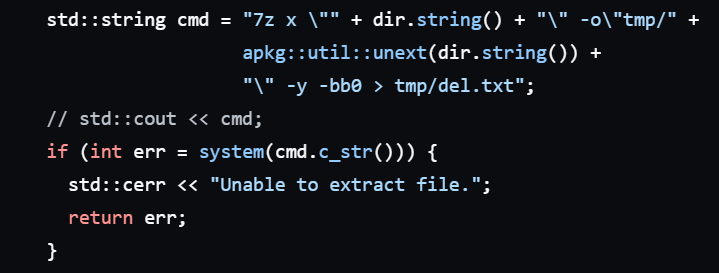

# Projects

Here\'s a list of my projects, which can be considered my portfolio.

Projects I\'m currently working on

- ArcCreate Archival Project

Projects I\'m putting on hold

- Brainfck
- Antiformatter
- csstdLib

Projects I do not intend to maintain

- Arccreate-rd

Projects I consider complete

- String sort
- Cinitpp

___

## String Sort

A CLI that sorts a string by alphabetical order. In a... Different way.

Written in C++

[<ins>Github</ins>](https://github.com/Renjian-buchai/string-sort)

[<ins>Gitlab</ins>](https://gitlab.com/renjian-buchai/string-sort)

___

## Antiformatter

A CLI that formats files. Also in a... Different way.

Written in C++, regardless of what github claims.

It\'s a meme project, so I set out to make it as cursed as possible.

[<ins>Github</ins>](https://github.com/Renjian-buchai/anti-formatter)

[<ins>Gitlab</ins>](https://gitlab.com/renjian-buchai/anti-formatter)

___

## Brainfck

An interpreter for the esoteric programming language [Brainfuck](https://en.wikipedia.org/wiki/Brainfuck).

[<ins>Github</ins>](https://github.com/Renjian-buchai/bfuck01)

[<ins>Gitlab</ins>](https://gitlab.com/renjian-buchai/bfuck01)

___

## Cinitpp

A CLI to initialise a project with a single command.

It can parse a directory directly, and save it as a template for future initialisation. The templates are stored in easy to modify .json.

[<ins>Github</ins>](https://github.com/Renjian-buchai/cinitpp)

[<ins>Gitlab</ins>](https://gitlab.com/renjian-buchai/cinitpp)

___

## ArcCreate Archive

An archive of charts for ArcCreate, an emulator for Arcaea meant to accomodate fanmade charts.

The intention is to archive each chart at the end of each year, after that year's ACC (ArcCreate Charting Competition).

Meanwhile, the information within the charts are stored in an sqlite .db for future use, in case anyone wants to analyse the trends in the files.

[<ins>Github</ins>](https://github.com/ArcCreate-Archival-Team)

___

### ArcPkg-rd

A reader for .arcpkg files, that are used to store the abovementioned ArcCreate fanmade charts.

It was made for the sole purpose of making the ArcCreate Archive, not for portability nor safety. Thus, I discourage the use of the reader on unvetted files.
Especially since it contains the following lines of code:

[<ins>Github</ins>](https://github.com/ArcCreate-Archival-Team/ArcCreate-rd/)

[<ins>Gitlab</ins>](https://gitlab.com/arccreate-archival-team/arccreate-rd)
